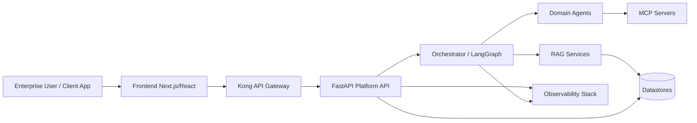
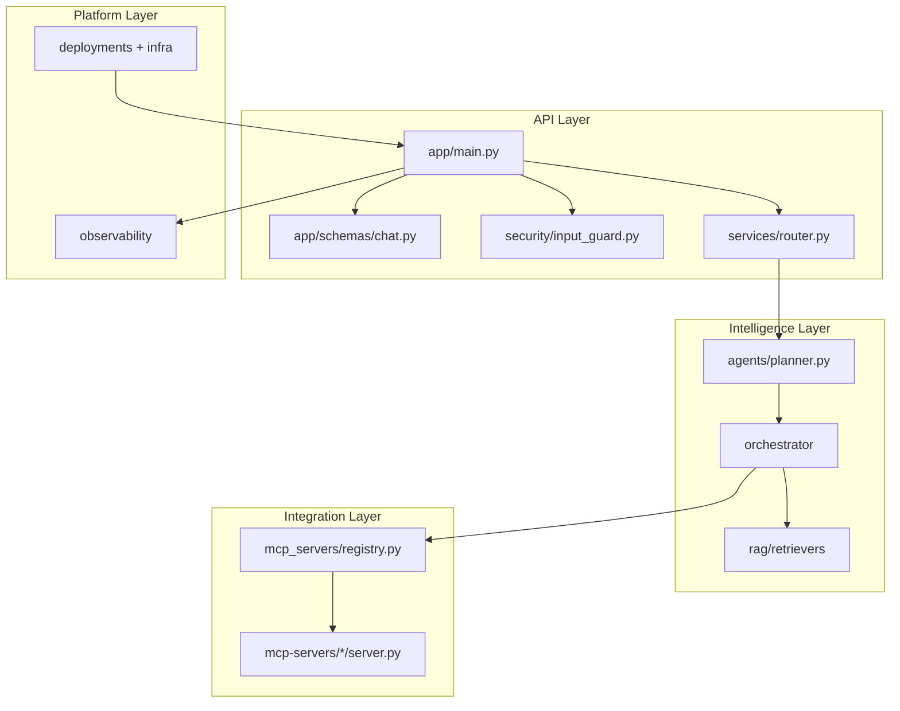
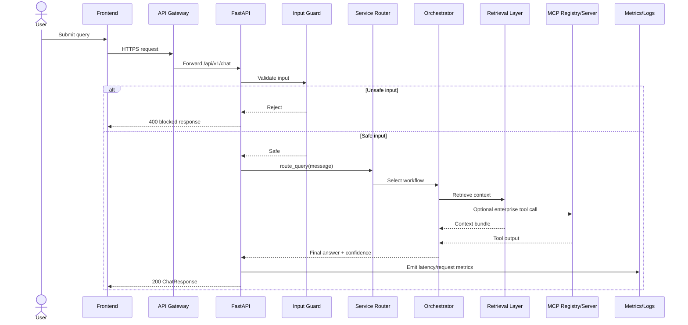
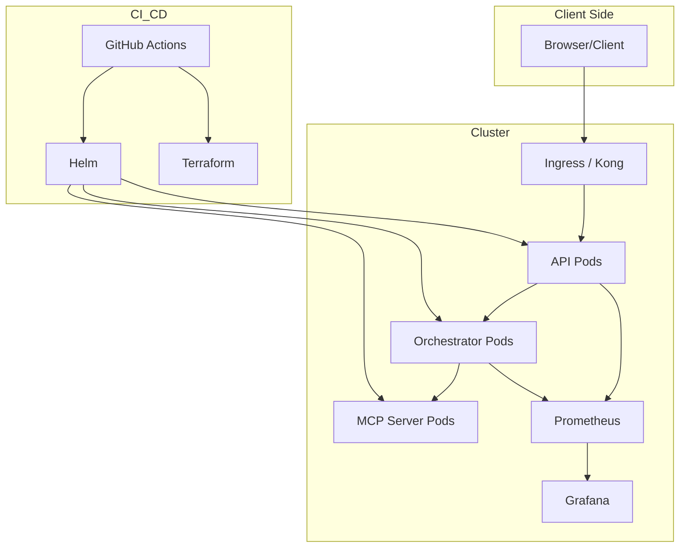
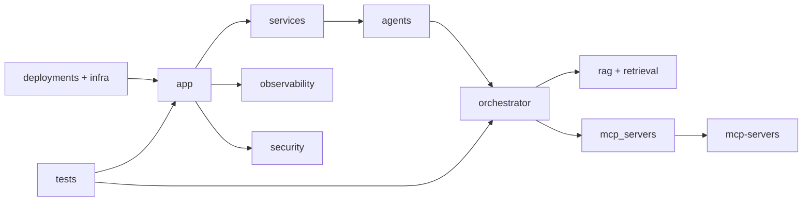

# End-to-End UML Artifacts

This document provides an end-to-end architecture UML set for `production-ai-app` and aligned enterprise folders.

## 1) System Context Diagram

## 2) Component Diagram

## 3) Sequence Diagram (End-to-End Request)

## 4) Deployment Diagram

## 5) Package/Folder Dependency View

