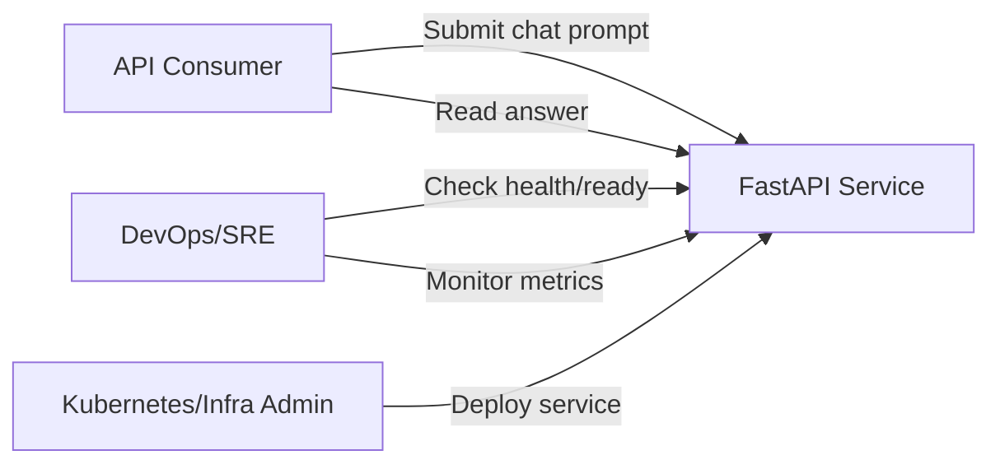
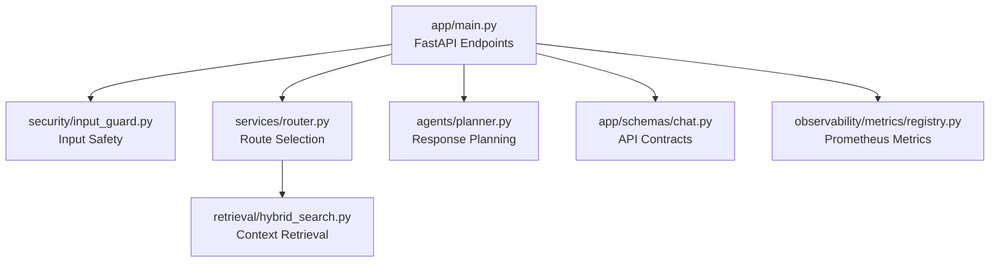
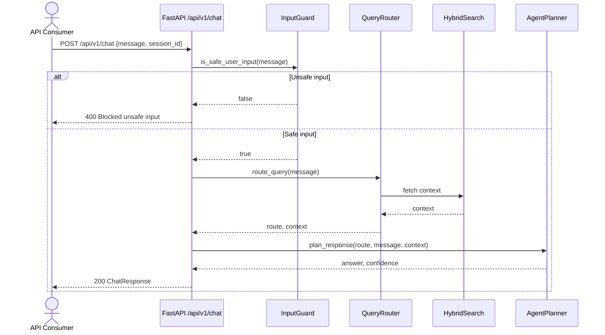
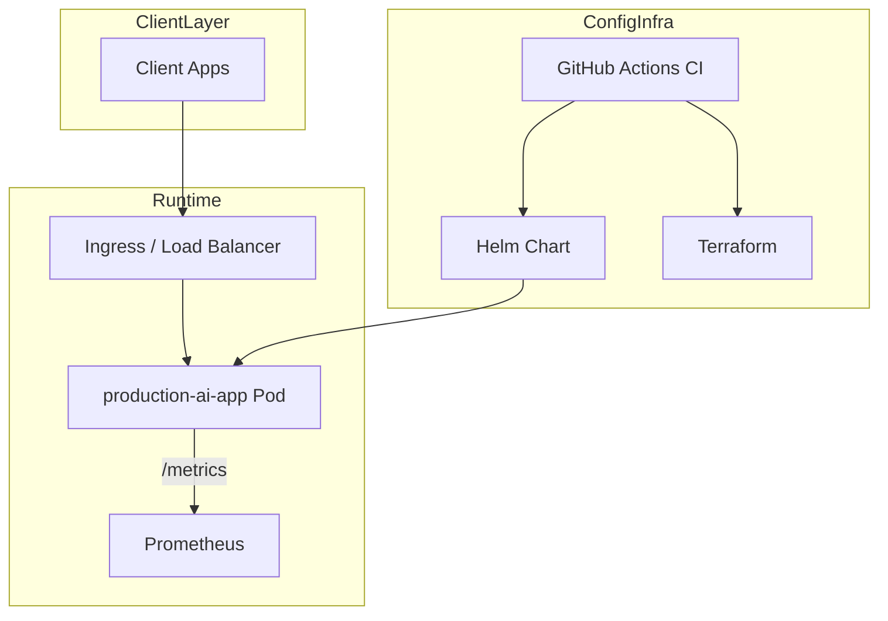
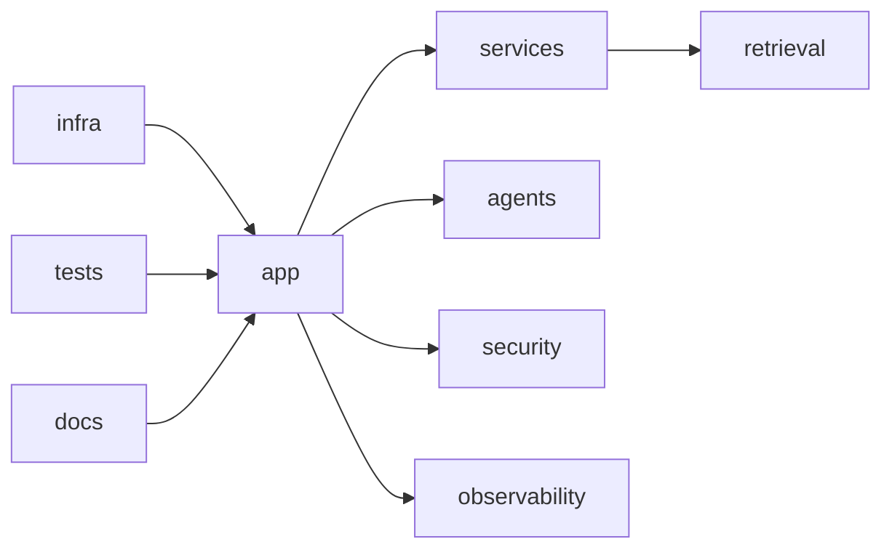

# UML Artifacts

This document provides core UML views for `production-ai-app` using Mermaid.

## 1) Use Case Diagram

## 2) Component Diagram

## 3) Sequence Diagram (Chat Request)

## 4) Deployment Diagram

## 5) Package/Folder View

