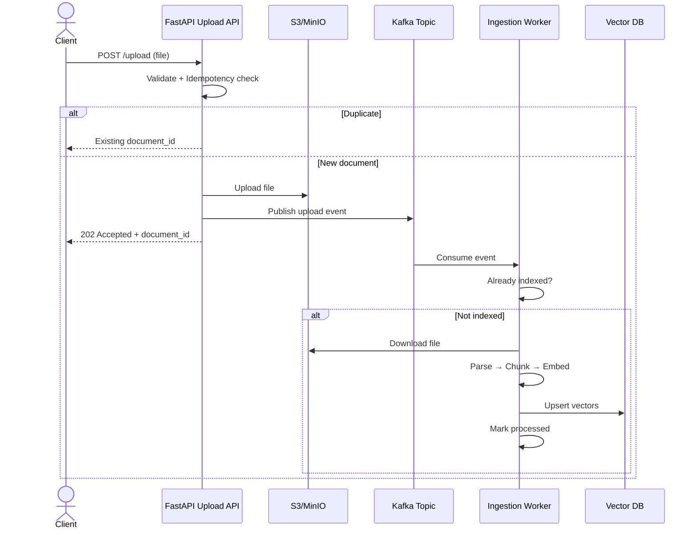

# Document RAG System — Architecture

End-to-end document upload and RAG ingestion pipeline.

## Flow Overview

```
Client
  │ POST /api/v1/upload
  ▼
FastAPI Upload API
  ├─ Validate file (.pdf, .docx, .csv)
  ├─ Idempotency check (SHA-256 hash)
  ├─ Generate Document ID (if new)
  ├─ Upload to S3 (MinIO)
  ├─ Publish Kafka event
  └─ Return 202 Accepted

Kafka Topic: document.upload
  │
  ▼
Ingestion Worker
  ├─ Already indexed? → Ignore / Ack
  ├─ Download from S3
  ├─ Parse document
  ├─ Split into chunks
  ├─ Generate embeddings
  ├─ Store in Vector DB (Chroma)
  └─ Mark document processed

On failure:
  ├─ Retry (up to 3 times)
  └─ Dead Letter Queue: document.upload.dlq
```

## Components

| Layer | Folder | Responsibility |
|-------|--------|----------------|
| API | `app/` | Upload endpoint, validation, idempotency |
| Messaging | Kafka | Async decoupling between API and worker |
| Storage | S3/MinIO | Raw document storage |
| Worker | `worker/` | Parse, chunk, embed, index |
| Vector DB | Chroma | Semantic search index |
| Shared | `shared/` | Event and domain models |

## API Endpoints

- `POST /api/v1/upload` — Upload document (202 Accepted)
- `GET /api/v1/documents/{id}` — Check ingestion status
- `GET /health` — Health check

## Sequence Diagram



## UML Artifacts

For the full end-to-end UML set (context, component, sequence, activity, state machine, class, deployment, and data-flow diagrams), see [uml-artifacts.md](./uml-artifacts.md).
