# End-to-End UML Artifacts

This document provides a complete UML artifact set for the **Document RAG System** — from client upload through async ingestion, vector indexing, retry handling, and status polling.

---

## 1) System Context Diagram

High-level actors and external systems interacting with the pipeline.

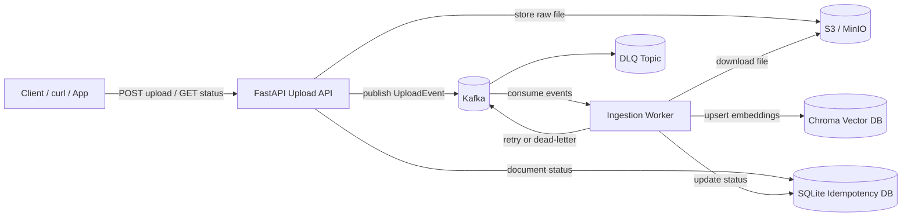

---

## 2) Component Diagram

Internal modules mapped to repository folders.

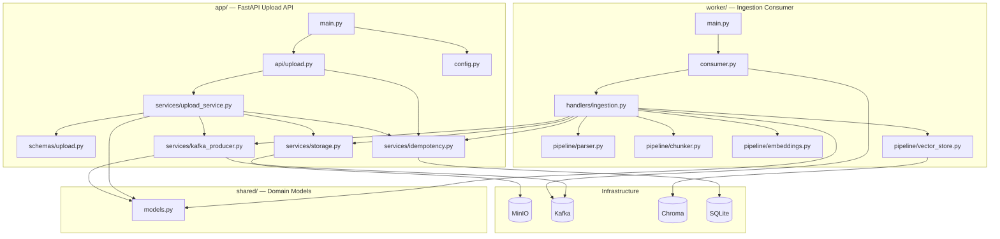

---

## 3) Sequence Diagram — Upload (Happy Path)

`POST /api/v1/upload` from client acceptance through Kafka publish.

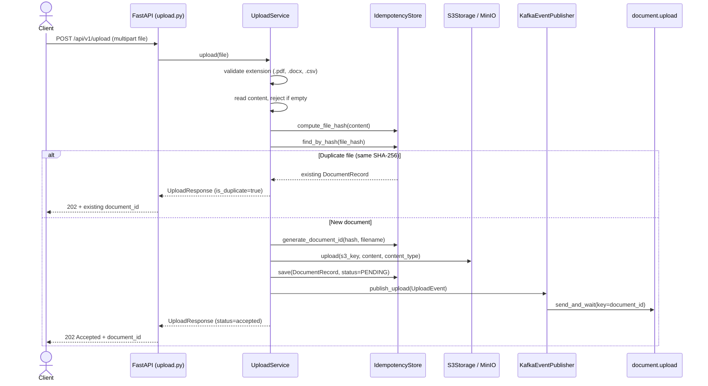

---

## 4) Sequence Diagram — Ingestion Worker (Happy Path)

Kafka consumer through parse → chunk → embed → vector store.

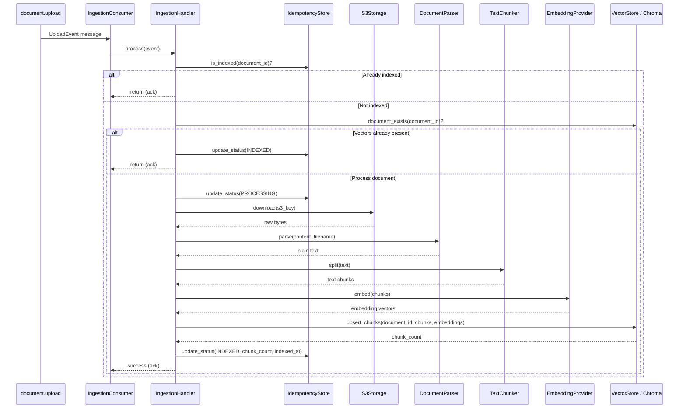

---

## 5) Sequence Diagram — Retry and Dead Letter Queue

Failure handling with up to `MAX_RETRIES` (default 3) re-publishes.

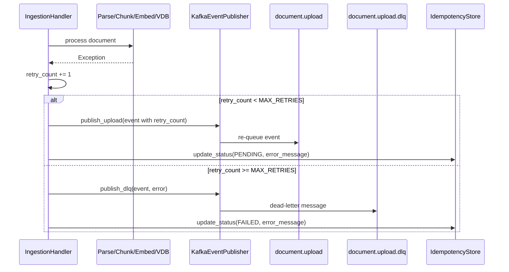

---

## 6) Sequence Diagram — Document Status Polling

`GET /api/v1/documents/{document_id}` for ingestion progress.

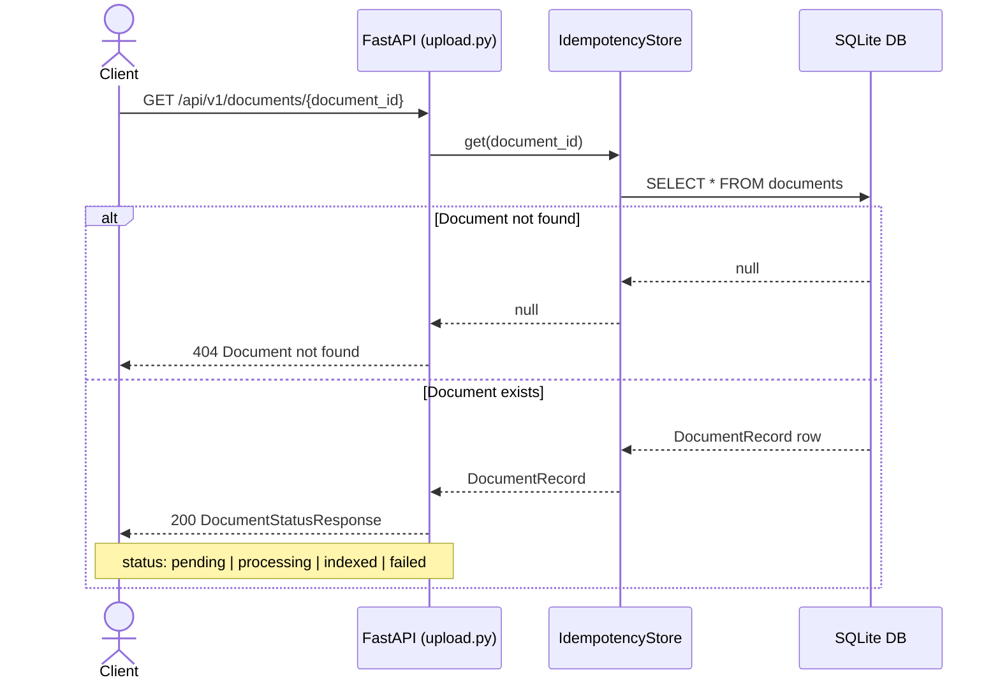

---

## 7) Activity Diagram — End-to-End Flow

Full lifecycle from upload request to indexed or failed state.

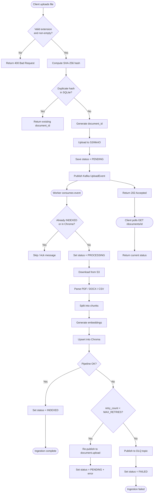

---

## 8) State Machine — Document Status

Transitions stored in the SQLite idempotency database.

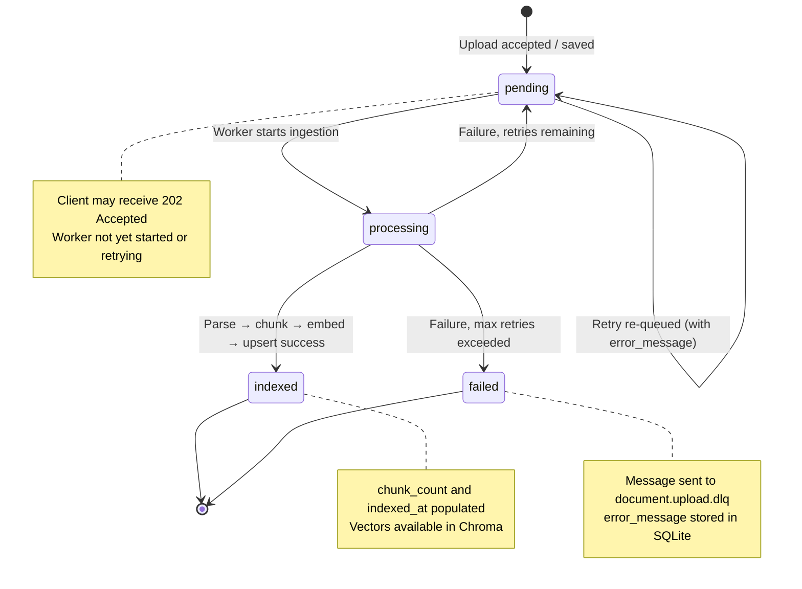

---

## 9) Class Diagram — Domain Models

Core Pydantic models in `shared/models.py` and API schemas.

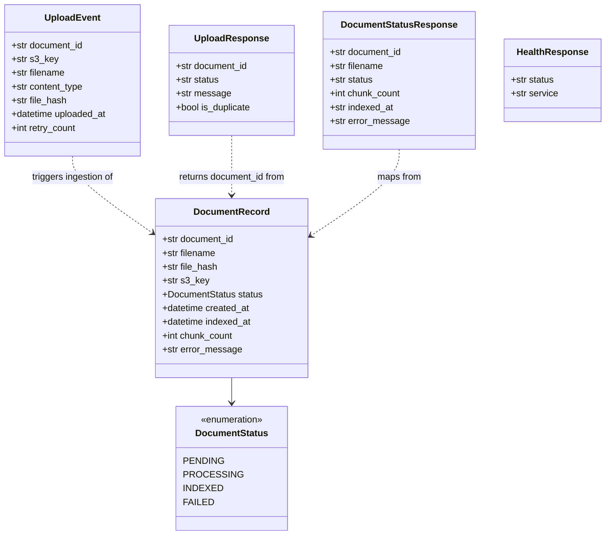

---

## 10) Deployment Diagram — Docker Compose Stack

Local and containerized runtime topology.

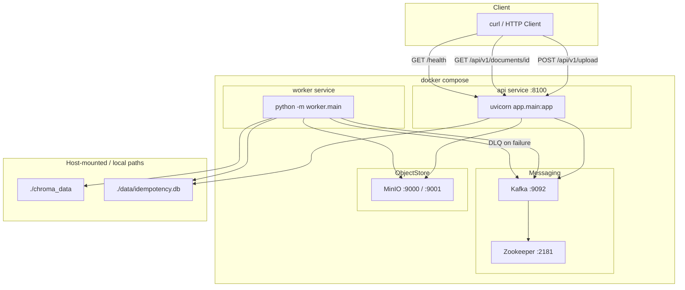

---

## 11) Package / Folder Dependency View

Repository layout and import direction.

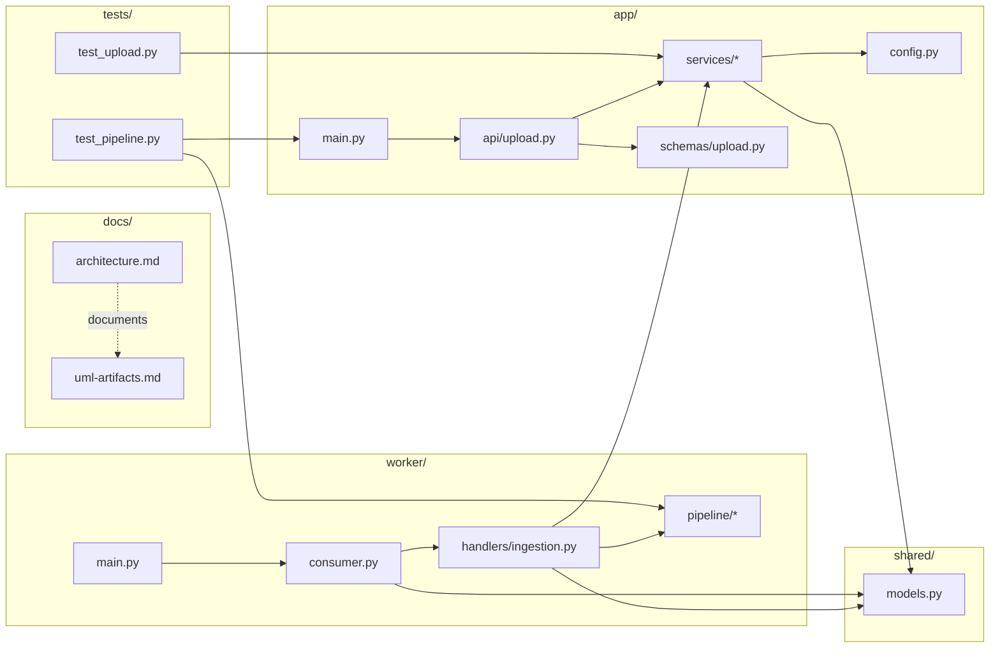

---

## 12) Data Flow Diagram — Ingestion Pipeline Stages

How raw bytes become searchable vectors.

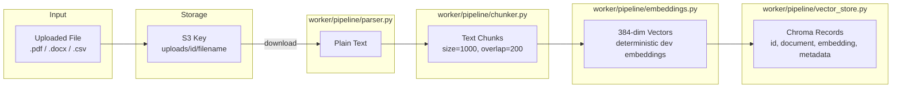

---

## 13) API Endpoint Map

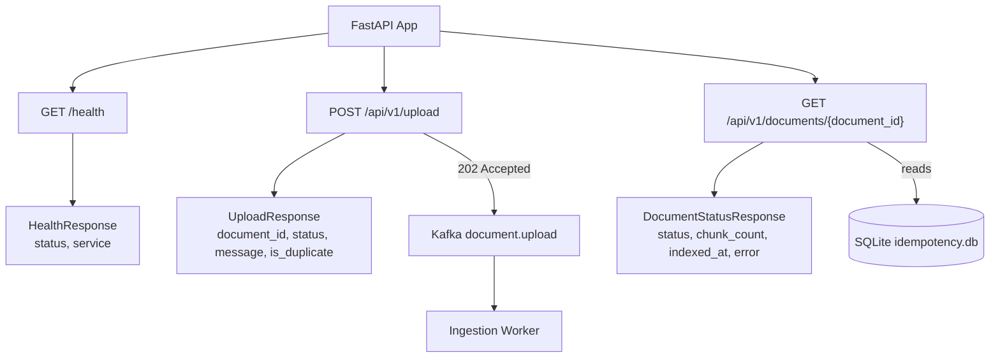

---

## Related Documentation

| Document | Purpose |
|----------|---------|
| [architecture.md](./architecture.md) | Narrative architecture and primary sequence diagram |
| [../README.md](../README.md) | Quick start, Docker, curl examples |
| [../.env.example](../.env.example) | Environment variable reference |

---

## Diagram Index

| # | Diagram | Type | Scope |
|---|---------|------|-------|
| 1 | System Context | C4 / Context | External systems |
| 2 | Component | Component | `app/`, `worker/`, `shared/` |
| 3 | Upload Happy Path | Sequence | API upload flow |
| 4 | Ingestion Happy Path | Sequence | Worker pipeline |
| 5 | Retry & DLQ | Sequence | Failure handling |
| 6 | Status Polling | Sequence | GET document status |
| 7 | End-to-End Activity | Activity | Full lifecycle |
| 8 | Document Status | State Machine | Status transitions |
| 9 | Domain Models | Class | Pydantic schemas |
| 10 | Docker Compose | Deployment | Infrastructure |
| 11 | Folder Dependencies | Package | Repo structure |
| 12 | Pipeline Data Flow | Data Flow | Parse → index |
| 13 | API Endpoint Map | Component | HTTP surface |
